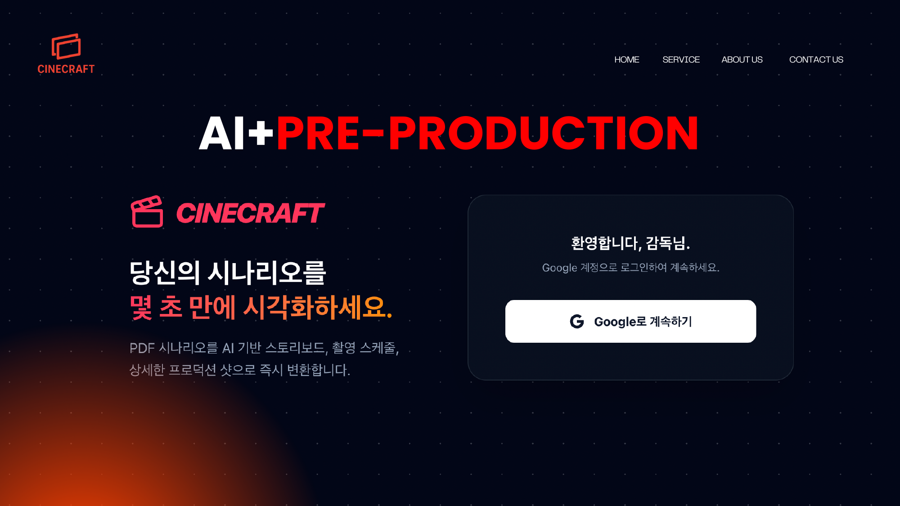
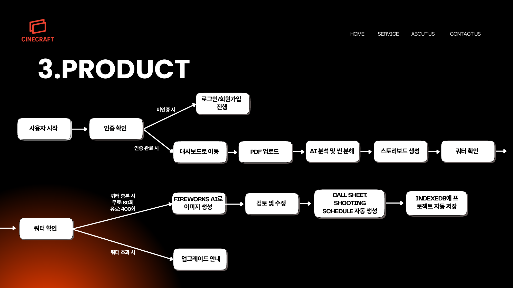
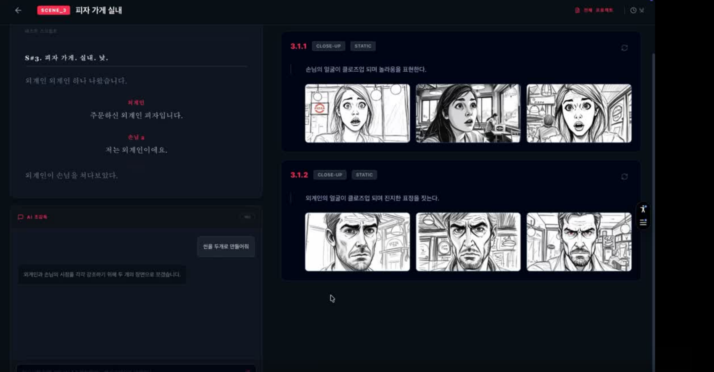

<div align="center">

# 🎬 CineCraft

### AI가 시나리오를 스토리보드·샷리스트·일촬표·콜시트로 바꿔드립니다

**PDF 시나리오 한 장이면 충분합니다. 프리프로덕션 문서 작업, 몇 초 만에 끝내세요.**

[](https://nextjs.org/)
[](https://react.dev/)
[](https://www.typescriptlang.org/)
[](https://tailwindcss.com/)
[](https://next-auth.js.org/)

</div>

<br/>

<div align="center">
  
</div>

<br/>

## 📽️ 데모 영상

https://github.com/user-attachments/assets/a3c76b85-997b-44b2-8edf-aa34753019ec

<br/>

## 🧭 CineCraft가 필요한 이유

OTT와 1인 미디어 확산으로 영상 콘텐츠 제작 수요는 계속 늘고 있지만, **정작 기획 단계에서 쓸 수 있는 도구는 여전히 제한적**입니다.

- 스토리보드, 샷리스트, 일촬표, 콜시트는 아직도 대부분 **수작업**으로 만들어집니다. 일정 한 줄만 바뀌어도 문서 전체를 다시 손봐야 합니다.
- StudioBinder, ShotGrid 같은 전문 툴은 팀 단위 제작사를 위한 협업 SaaS라 **월 수만~수십만 원**의 비용과 복잡한 기능이 따라붙습니다.
- Storyboarder, Filmustage 같은 기존 AI 스토리보드 서비스도 레퍼런스 이미지를 직접 올려야 하거나, 씬마다 반복 클릭이 필요해 **정작 기획 초기 단계에서는 쓰기 번거롭습니다.**

그 결과 **영화 비전공자, 대학생, 독립·단편영화 감독 지망생**은 정작 가장 필요한 순간에 쓸 만한 도구가 없습니다. 실제 인터뷰 기준, 스토리보드 한 편을 손으로 완성하는 데는 평균 **16시간**이 걸립니다.

## 💡 CineCraft의 해법

**시나리오 입력 → 스토리보드 생성 → 촬영 문서 출력.** 딱 이 세 단계로 끝냅니다.

1. PDF(또는 문서) 시나리오를 업로드하면 AI가 씬 단위로 자동 분해합니다.
2. 각 씬마다 여러 구도의 스토리보드 컷을 AI가 자동으로 제안하고, 채팅으로 바로 수정 요청할 수 있습니다.
3. 확정된 컷을 바탕으로 **샷리스트, 일촬표, 콜시트**가 자동으로 완성되어 바로 촬영 현장에서 쓸 수 있습니다.

이미지 생성 비용이 낮은 모델을 채택해 **월 9,900원**이라는 가격으로 서비스를 운영하며, 동일한 작업을 **1~2시간**으로 단축합니다 (기존 평균 대비 약 8~16배 단축).

<br/>

## ✨ 핵심 기능

| 기능 | 설명 |
| --- | --- |
| 📄 **시나리오 자동 분석** | PDF/문서를 업로드하면 AI가 씬(Scene) 단위로 자동 분해 |
| 🎨 **AI 스토리보드 생성** | 씬마다 여러 구도의 컷을 자동 생성, 다중 샷 아이디어까지 제안 |
| 💬 **AI 초감독 채팅** | "씬을 두 개로 나눠줘" 같은 자연어 요청으로 스토리보드를 즉시 재구성 |
| 🎬 **샷리스트 자동 생성** | 확정한 컷을 기반으로 촬영용 샷리스트 PDF 출력 |
| 🗓️ **일촬표 & 콜시트 자동화** | 촬영 일정을 입력하면 일촬표와 콜시트를 자동 완성 |
| 💾 **프로젝트 자동 저장** | 브라우저(IndexedDB)에 프로젝트를 자동 저장, 언제든 이어서 작업 |
| 🔐 **Google 로그인 & 요금제 관리** | NextAuth 기반 로그인과 Free/Pro 쿼터 관리 |

<br/>

## ⚙️ 어떻게 작동하나요

<div align="center">
  
</div>

```
사용자 시작 → 로그인(Google) → PDF 업로드 → AI 분석 및 씬 분해
  → 스토리보드 생성(Fireworks AI) → 검토 및 수정
  → 콜시트 · 일촬표 자동 생성 → 프로젝트 자동 저장
```

무료 플랜은 월 80장, Pro 플랜(월 9,900원)은 월 600장의 이미지 생성 토큰을 제공하며, 쿼터를 넘으면 업그레이드 안내로 자연스럽게 전환됩니다.

<br/>

## 🖥️ 실제 화면

<div align="center">
  
  <p><sub>씬별 스토리보드 생성 화면 — 왼쪽은 시나리오, 오른쪽은 AI가 생성한 컷, 하단은 AI 초감독 채팅</sub></p>
</div>

<br/>

## 🤖 사용 중인 AI 모델

| 모델 | 용도 |
| --- | --- |
| **ChatGPT (OpenAI)** | 시나리오 분석, 씬 분해, 샷리스트/문서 생성 |
| **Fireworks AI (FLUX 계열)** | 스토리보드 이미지 생성 (장당 약 $0.0014, 저비용 구조) |
| **Nano Banana (Google)** | 이미지 후처리 실험 |

<br/>

## 🏆 왜 CineCraft인가 — 경쟁 서비스 비교

| 구분 | StudioBinder | Boords | ShotPro | Storyboarder | Filmustage | **CineCraft** |
| --- | :---: | :---: | :---: | :---: | :---: | :---: |
| 주요 기능 | 제작 관리·콜시트 | 스토리보드 제작 | 촬영 구도 설계 | 손그림 스토리보드 | 스크립트 브레이크다운 | **문서 자동화 통합** |
| 시나리오 입력 기반 자동화 | 제한적 | 제한적 | ✗ | ✗ | ✓ | **✓** |
| 스토리보드 자동 생성 | ✗ (수동) | ✓ | ✗ | ✓ (수동) | ✗ | **✓** |
| 다중 구도/샷 아이디어 제안 | ✗ | 제한적 | ✗ | ✗ | ✗ | **✓** |
| 일촬표 자동화 | ✓ (콜시트 중심) | ✗ | ✗ | ✗ | ✓ | **✓** |
| 주요 타겟 | 제작사·팀 | 스토리보드 담당자 | 촬영 설계 보조 | 제작 매니지먼트 | 제작 매니지먼트 | **입문자·독립 제작자** |
| 가격대 | 월 수만~수십만 원 | 월 수만~수십만 원 | 월 수만~수십만 원 | 월 수만~수십만 원 | 월 수만~수십만 원 | **월 9,900원** |

CineCraft는 프리프로덕션 문서(스토리보드·샷리스트·일촬표·콜시트)를 **하나의 흐름으로 자동화**하면서, 영화 제작사가 아니라 **입문자·학생·독립 제작자**를 위한 가격과 사용성에 집중합니다.

<br/>

## 🛠️ 기술 스택

- **Framework**: Next.js 16 (App Router, Turbopack) · React 19 · TypeScript
- **UI/UX**: Tailwind CSS 4 · Framer Motion · lucide-react
- **Auth**: NextAuth.js (Google OAuth)
- **AI**: OpenAI API(ChatGPT) · Fireworks AI(이미지 생성)
- **문서 처리**: pdf-parse · pdfjs-dist · mammoth(docx) · jsPDF / jspdf-autotable(PDF 출력)
- **저장소**: 브라우저 IndexedDB 기반 프로젝트 자동 저장

<br/>

## 🚀 로컬에서 실행하기

```bash
git clone https://github.com/ChanU-404/cinecraft_web.git
cd cinecraft_web
npm install
npm run dev
```

`http://localhost:3000` 에서 확인할 수 있습니다. Google 로그인, OpenAI, Fireworks AI 연동을 위해 `.env.local`에 아래 환경 변수가 필요합니다.

```bash
GOOGLE_CLIENT_ID=...
GOOGLE_CLIENT_SECRET=...
NEXTAUTH_SECRET=...
OPENAI_API_KEY=...
FIREWORKS_API_KEY=...
```

<br/>

## 👥 팀

| 이름 | 역할 | 소속 |
| --- | --- | --- |
| **김찬우** | 대표 · 기획 및 영업 | 고려대학교 산업경영공학부 |
| **이유진** | 이사 · 전략 및 디자인 | 연세대학교 에너지환경융합학부 · 창의기술경영학부 |

<br/>

---

<div align="center">
<sub>CineCraft — 시나리오만 있으면, 프리프로덕션은 CineCraft가 대신합니다.</sub>
</div>
